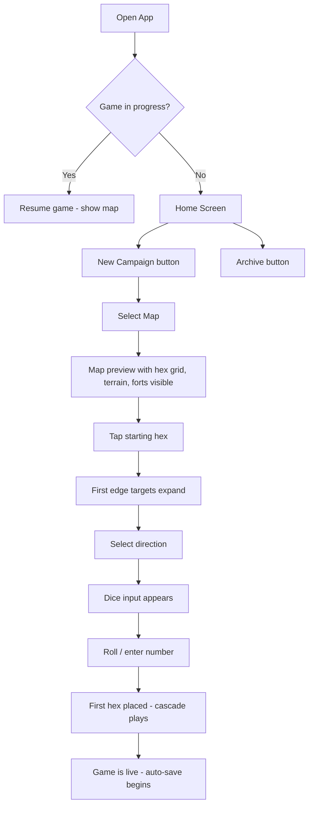
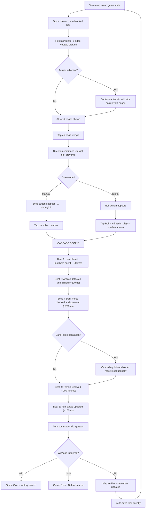
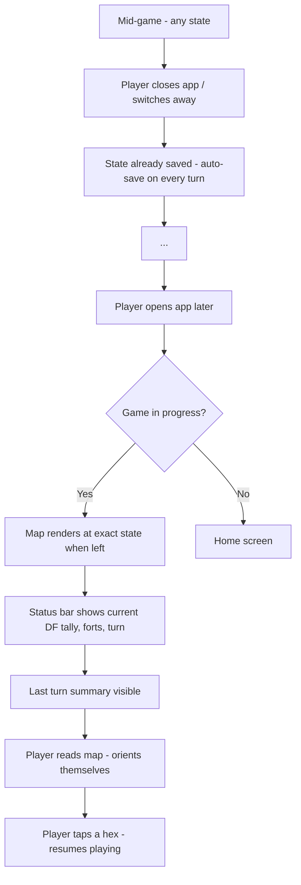
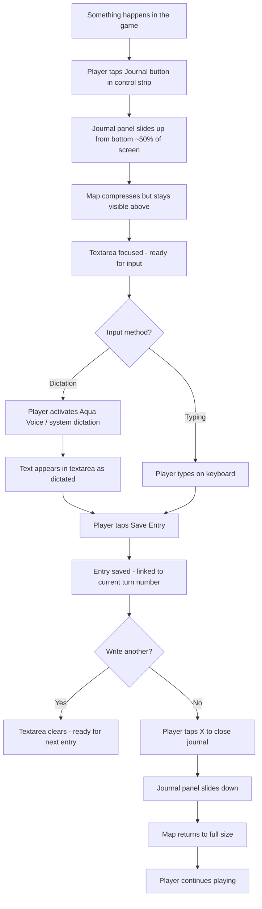
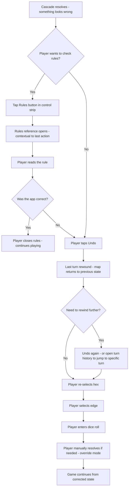
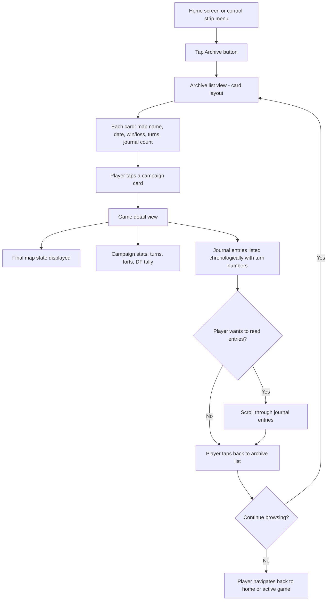

# UX Design Specification — Dark Force Incursion Companion App

**Author:** Taylor
**Date:** 2026-04-10

---

<!-- UX design content will be appended sequentially through collaborative workflow steps -->

## Executive Summary

### Project Vision

The Dark Force Incursion Companion App replaces paper-and-pencil play with an interactive hex grid that handles all game bookkeeping automatically — placement, orientation, armies, Dark Force, terrain, forts, win/loss — and runs on any device as a Progressive Web App. The app serves three integrated layers: a game engine (the visual hex map), a campaign journal (dictation-friendly narrative capture linked to game turns), and a campaign archive (browsable history of every game played). The game engine delivers standalone value; journaling and archiving layer on when the player is ready.

### Target Users

**Primary — Taylor:** Solo game hobbyist, intermediate developer, aspiring writer. Plays in 2-3 minute windows between other activities (TV, waiting rooms, downtime). Prefers dictation via Aqua Voice over typing. Loves physical dice but needs digital dice for on-the-go play. Uses phone as primary gaming device, desktop for writing sessions, but browses archive and past campaigns on both. Content creation goals: blog posts, let's-play recordings, short stories drawn from campaign journal entries. Zero budget — all tools must be free/open-source.

**Secondary — Family members:** May pick up the game using the app as an easier entry point than paper. Less familiar with DFI rules; benefit from a clean, simple interface that doesn't overwhelm.

### Key Design Challenges

1. **Progressive hex density on phone screens:** The map starts as a grid of empty hexes with terrain and forts pre-marked. Hexes gain their six oriented numbers only when claimed through play, expanding outward from a single starting point. Early game, most hexes are empty — the density problem is manageable. The real legibility challenge arrives mid-to-late game when 30-40+ claimed hexes are packed with numbers, army circles, Dark Force rectangles, and blocked markers. The UX must handle both the sparse early map and the dense late-game state gracefully on phone screens (~360-430px).

2. **Edge selection as primary interaction:** The core game loop requires selecting a direction (one of six edges) from a claimed hex toward unclaimed territory or terrain. On touch screens, six edges per hex are small tap targets. Edge selection must feel natural, forgiving, and error-free — misselecting an edge mid-game is frustrating and requires undo.

3. **Terrain as a living landscape:** Terrain hexes (mountains, forests, lakes, marshes, muster, ambush) are visible on the map from the start but only activate when adjacent to claimed hexes. Critically, some terrain remains active and can be triggered repeatedly — a mountain surrounded by claimed hexes is a persistent hazard on every qualifying roll. The map must communicate three terrain states: visible-but-unreachable (informational), active/live (adjacent to claimed hexes, can fire on qualifying rolls), and the current resolution status. The player needs to read the strategic risk landscape at a glance when choosing which hex to roll from.

4. **Journal without flow disruption:** The journal must open fast, accept a quick dictation, and close without obscuring the game state the player is narrating about. The player wants to see the map while describing what happened on it. Journal entries are both in-character narrative and strategic reflection — the UI must not nudge toward either voice.

### Design Opportunities

1. **The map as visual storytelling:** The hex grid isn't a data table — it's a battlefield that grows outward from a single starting point. Each claimed hex is conquered territory. The boundary between claimed and unclaimed hexes is the front line. Terrain ahead is a visible landscape to navigate. Dark Force markers are enemy positions creeping in. If the visual design leans into this — terrain textures, atmospheric color, clear state language — the map becomes something the player *wants* to look at. This visual quality serves both the play experience and OBS recording at 1080p.

2. **Progressive disclosure of complexity:** MVP includes mountains only; Phase 2 adds five terrain types. The visual language can start clean and grow with the player. New players (family) see a simpler game; expansion players see the full visual vocabulary. Complexity is revealed, not imposed.

3. **The archive as trophy case:** Every completed game is a campaign fought. The archive should feel like flipping through a personal war journal — date, map, outcome, journal count, final map thumbnail — not scrolling a file list. Past campaigns are achievements to revisit, not data to manage.

4. **Terrain as strategic scouting:** Because terrain is visible before it's reached, the map doubles as a planning tool. The player can see mountains ahead and choose to roll a different direction. Surfacing terrain risk when a hex is selected (contextual rules reference) turns the app into a strategic advisor without adding complexity — the information appears when it's relevant and stays hidden when it's not.

## Core User Experience

### Defining Experience

The core experience is the **tap-roll-cascade** loop. The player selects a claimed hex, picks a direction, rolls (physical die with manual entry or digital dice), and watches the result unfold as a choreographed visual sequence: hex placed → numbers oriented → consequences ripple out (armies detected, Dark Force spawned, terrain resolved). The cascade is the moment the app comes alive — the map *responds* to the roll, and the player watches the battlefield shift before settling into its new state.

This loop must feel fast enough to maintain rhythm (complete within 1-2 seconds of animation after input) but slow enough to follow (each consequence visually distinct and sequential). The player should be able to track what happened without reading a log — the animation *is* the narration.

Everything else in the app — journal, archive, undo, rules reference, settings — orbits this core loop. None of it should interrupt the loop unless the player explicitly invokes it.

### Platform Strategy

**Progressive Web App** across three form factors:

- **Phone (portrait, primary):** The couch, the car, the waiting room. Touch-first. The hex grid, dice input, and turn summary must all be usable with one hand. 2-3 minute play windows between other activities. The most constrained screen and the most important one to get right.
- **Tablet (portrait/landscape):** More breathing room for the hex grid. Comfortable extended play sessions. Same touch interactions as phone, scaled up.
- **Desktop (landscape):** Writing sessions — archive browsing, journal review, campaign replay (Phase 2). Mouse and keyboard. Wider layout allows hex grid and journal side by side.

**Offline-first:** The app works identically with or without a network connection. All gameplay, journaling, and archive browsing happen locally. Cloud sync is background and non-blocking.

**Installable:** PWA installation on Android (Chrome) and desktop (Chrome/Firefox). Functional as a web app on iOS Safari even with limited PWA support.

### Effortless Interactions

**Must be effortless (zero friction, zero thought):**

- **Pause and resume:** Close the app mid-turn, open it later, same state. No save prompts, no "restore session?" dialogs, no "where was I?" confusion. The map tells you where you are.
- **Consequence resolution:** Armies, Dark Force, terrain, forts — all resolve automatically as a visual sequence. No confirmation dialogs, no "Dark Force spawned — OK?" modals. The animation plays, the turn summary appears, play continues.
- **New game after game over:** Win or loss → two taps to start a fresh campaign. No navigating back to a menu, no multi-step setup.

**Must be fast (low friction, minimal thought):**

- **Dice input:** Manual entry is a single tap on a number (1-6). Digital dice is a tap to roll. No extra steps.
- **Journal entry:** Tap to open, dictate or type, tap to close. The map remains visible behind/beside the journal panel.
- **Undo:** One tap to undo the last turn. Rewind to any prior turn available but not the default path — most undos are "I just made a mistake."

**Must be automatic (no user action required):**

- **Auto-save:** Game state persists on every turn without the player doing anything.
- **Dark Force tally:** Running count maintained and displayed at all times.
- **Win/loss detection:** The app knows when the game is over. The player doesn't have to count forts or Dark Force armies manually.

### Critical Success Moments

1. **The cascade moment (defines the app):** The player rolls, picks a direction, and watches the hex place, numbers orient, an army pair light up, a Dark Force spawn, and a terrain rule redirect movement — all in one fluid visual sequence. This is the moment the player thinks "this is better than paper." If this moment feels mechanical or confusing, the app fails. If it feels alive and readable, everything else works.

2. **The trust moment (makes or breaks long-term use):** The first time a terrain rule fires — a mountain blocks the source hex, a forest redirects movement along its contour — and the app does it *correctly*. The player sees the result, checks it against their understanding of the rules, and it's right. Trust in the engine is established. If terrain resolution is wrong, the player loses confidence and starts double-checking every turn — which is the bookkeeping the app was supposed to eliminate.

3. **The resume moment (proves the app's value):** The player opens the app two days after pausing mid-game. The map is there, the state is clear, the journal has their last note. They tap a hex, roll, and pick up exactly where they left off. No friction. The game lives in their pocket.

4. **The story moment (unlocks the creative layer):** Mid-game, something dramatic happens — a fort lost, a desperate flank, a lucky roll. The player taps the journal, dictates two sentences capturing the moment in their own words, closes the journal, and keeps playing. The story is captured without breaking flow. Later, in the archive, those moments are there waiting to become a blog post or a short story.

### Experience Principles

1. **The map is the interface.** The hex grid isn't a component of the UI — it *is* the UI. Game state, strategic options, danger zones, progress, and narrative are all readable from the map. Minimize chrome around the map. Maximize the map.

2. **Resolve, don't ask.** The app resolves consequences automatically and shows the result visually. It never interrupts play to confirm what it did. Undo is the correction path — not confirmation dialogs.

3. **Interruptible, not atomic.** Play happens in 2-3 minute windows. Every moment is a safe pause point. The app never penalizes the player for setting it down. State is always saved, always resumable, always visually readable at a glance.

4. **Earn trust through correctness.** The rule engine's accuracy is the foundation of the entire experience. If the player trusts the engine, they play freely. If they doubt it, they're doing mental bookkeeping — and the app has failed its purpose. Terrain resolution must be correct. When it isn't, undo and override must be fast and obvious.

5. **The journal is a door, not a wall.** Journaling is always available, never required, never intrusive. It opens fast, stays out of the map's way, accepts whatever the player wants to say, and closes without ceremony. The creative layer is an invitation, not an obligation.

## Desired Emotional Response

### Primary Emotional Goals

- **Command:** The player is the general. The map is their war table. Every decision — which hex to roll from, which direction to push, when to risk a terrain encounter — is a strategic choice made with full information. The app presents the battlefield; the player commands it.
- **Absorption:** The game pulls the player in. The tap-roll-cascade loop creates a rhythm that sustains attention across 2-3 minute play windows. The player loses awareness of the app as software and experiences it as *the game*.
- **Relaxation:** The bookkeeping is gone. The mental overhead of tracking hex orientations, army pairs, Dark Force tallies, and terrain interactions has been handed to the engine. What's left is the strategic and narrative pleasure of the game — leisure, not labor.

### Emotional Journey Mapping

| Moment | Desired Feeling | Design Implication |
|---|---|---|
| **Opening the app (resume)** | Calm recognition — "picking up a bookmark." Immediate orientation, no re-learning curve. | Map state readable at a glance. No splash screens, no loading interstitials, no "welcome back" modals. The game is just *there*. |
| **Selecting a hex and direction** | Quiet confidence — "I know what I'm doing." Strategic anticipation. | Clear visual indication of valid edges, terrain risks nearby, current game state. The player feels informed, not guessing. |
| **The cascade (roll result)** | Absorbed engagement — watching the consequences unfold. A micro-narrative plays out on the map. | Choreographed visual sequence: hex placed → numbers oriented → armies/Dark Force/terrain resolve sequentially. Fast enough to maintain rhythm, slow enough to follow. |
| **Something goes wrong (bad roll, terrain hazard)** | Acceptance with strategic recalibration — "okay, new plan." Not frustration, not surprise. | The consequence is shown clearly. The player understands *why* it happened. The rules reference is one tap away if needed. Undo is available but not pushed. |
| **Journaling** | Low-pressure creative impulse — "I want to capture this." Never obligation. | Journal opens fast, stays out of the map's way, accepts whatever the player says, closes without ceremony. No prompts, no "you haven't journaled in 3 turns" nudges. |
| **Game over (win or loss)** | Quiet satisfaction — closing a chapter. A clean sense of completion. | Understated game-over moment. Summary of the campaign (turns, forts, Dark Force tally, journal entries). The map as the visual monument. No fireworks, no dramatic defeat screen. A clear path to "play again" or "save and browse." |
| **Browsing the archive** | Reflective pride — looking back at campaigns fought. | Each entry feels like a chapter heading. Enough metadata to spark memory (date, map, outcome, journal count). Thumbnail of the final map state. |

### Micro-Emotions

**Critical to sustain:**
- **Confidence over confusion:** The player always knows what just happened and why. Visual state is unambiguous. The cascade animation narrates each consequence. The turn summary confirms what occurred.
- **Trust over distrust:** The rule engine is correct. When the player checks a terrain resolution against their understanding of the rules, it matches. When it doesn't, undo and override are fast and obvious — trust is repaired, not shattered.
- **Clarity over overwhelm:** The map is dense in late game but never unreadable. Zoom, pan, and clear visual hierarchy (claimed vs. unclaimed, active terrain vs. inert) keep the information parseable. The player can always find the frontier and read the risk landscape.

**Important to avoid:**
- **Guilt:** The journal is never an obligation. No empty-state messages like "No journal entries yet!" No streaks, no prompts, no gamification of writing. The door is open; the player walks through it when they want to.
- **Anxiety:** The app auto-saves every turn. The player never worries about losing progress. Closing the app is always safe. There is no "are you sure you want to quit?" dialog.

### Design Implications

| Emotional Goal | UX Design Approach |
|---|---|
| Command | Map-dominant layout. Minimal chrome. Player sees the full battlefield. Controls are accessible but not prominent — the map is the interface, controls are tools at the edge. |
| Absorption | Tap-roll-cascade loop feels rhythmic and fluid. No interruptions from the system. Consequences resolve automatically. Turn summary is scan-friendly, not attention-demanding. |
| Relaxation | No bookkeeping surfaces in the UI. Dark Force tally, fort count, and turn number are displayed passively — always visible, never alarming. No countdown timers, no urgency cues. |
| Confidence (anti-confusion) | Every consequence animated distinctly. Turn summary strip confirms what happened. Contextual rules reference available on tap. Undo is always one tap away. |
| Trust (anti-distrust) | Rule engine correctness is the #1 quality priority. When the player checks, it's right. When it isn't, the override path is fast and obvious. |
| Clarity (anti-overwhelm) | Zoom and pan on the hex grid. Visual hierarchy separates claimed from unclaimed, active terrain from inert. Late-game density managed through clear state overlays, not smaller text. |

### Emotional Design Principles

1. **Understated, not dramatic.** The app's emotional register is calm and confident. No celebratory animations, no dramatic defeat screens, no attention-grabbing notifications. The game speaks through the map, not through UI theatrics.

2. **Inform, never alarm.** Game state information (Dark Force tally, fort status, terrain risks) is displayed passively and clearly. The app never creates urgency or anxiety — even when the game state is dire, the presentation is matter-of-fact. The tension comes from the game, not the interface.

3. **Invite, never obligate.** The journal, the archive, the rules reference — all optional layers that are available when wanted and invisible when not. No nudges, no empty-state guilt, no "you should" messaging. The player engages with each layer on their own terms.

4. **Repair, never punish.** When something goes wrong — a misselected edge, a misunderstood rule, an engine error — the correction path (undo, rewind, override) is fast, obvious, and judgment-free. The app never makes the player feel bad for making a mistake or disagreeing with the engine.

## UX Pattern Analysis & Inspiration

### Inspiring Products Analysis

No direct competitors or digital tabletop companions serve as reference points — the solo roll-and-write companion space is empty, and the player's gaming experience is rooted in physical play, not digital equivalents. Inspiration is drawn from UX patterns across unrelated domains that map to the app's specific interaction needs.

**Chess apps (Chess.com, Lichess) — Board-dominant interaction loop**
The closest analog to the tap-roll-cascade loop. The board dominates the screen. A move is tap-tap-result. Captures, check, and game state changes resolve visually and immediately. Controls sit at the edges — clock, move history, resign — but the board is the interface. Game state is always readable at a glance: piece positions, threats, and material balance are communicated through the board, not through panels or dashboards.

**Reading apps (Kindle, Pocket) — Frictionless resume**
Open the app, you're on the page you left off. No menu, no navigation, no "welcome back." The content is just *there*. This is the emotional model for resuming a paused game — calm recognition, immediate orientation, zero re-entry cost. The app remembers where you are so you don't have to.

**Note-taking apps (Apple Notes, Google Keep) — Quick capture**
Tap, type or dictate, done. No formatting, no folder selection, no title required. The entry exists the moment you create it. The gap between "I have a thought" and "it's captured" is nearly zero. This is the model for the campaign journal — open, say something, close. No ceremony, no structure imposed, no decisions required before you start writing.

**Weather apps — Passive information display**
Temperature, conditions, and forecast are always visible without interaction. You glance, you know. No tap required to see the essential state. This is the model for the Dark Force tally, fort count, and turn number — persistent, readable, ambient information that never demands attention but is always available.

### Transferable UX Patterns

**Navigation Patterns:**
- **Board-dominant layout (from chess apps):** The hex grid occupies the maximum available screen area. All other UI elements — controls, status, journal — sit at the edges or in overlay panels. The map is never squeezed to make room for chrome.
- **Bookmark resume (from reading apps):** Opening the app drops the player directly into their in-progress game. No home screen, no menu navigation, no "tap to continue." The game is the landing page.

**Interaction Patterns:**
- **Tap-target-result loop (from chess apps):** Select hex → select edge → roll → see result. Each step is one tap. The interaction rhythm is consistent and predictable. The player builds muscle memory quickly.
- **Quick capture overlay (from note-taking apps):** Journal opens as a slide-up panel or side drawer, accepts input immediately, and closes on a single tap. No modal transition, no full-screen takeover. The map stays visible behind or beside the journal.

**Visual Patterns:**
- **Glanceable status (from weather apps):** Dark Force tally, fort count (captured/total), and turn number displayed as a persistent, compact status bar. Always visible, never interactive, never alarming. The player absorbs game state passively.
- **Visual state language (from chess apps):** Piece color and shape communicate identity without labels. Similarly, hex state (claimed, blocked, fort, Dark Force, terrain) should be communicated through distinct visual treatments — color, pattern, iconography — not through text labels or legends.

### Anti-Patterns to Avoid

- **Dashboard-first layout:** Panels of stats, charts, and controls surrounding a shrunken game area. The map must never be subordinate to UI chrome. If it doesn't fit on screen, the chrome shrinks — not the map.
- **Modal interruptions for routine events:** "Dark Force army spawned! [OK]" — modals that pause play to confirm things the player can see on the map. Consequences resolve visually; the player is never asked to acknowledge routine game events.
- **Onboarding tutorials that block play:** Multi-step walkthrough overlays before the player can touch anything. The app should be learnable by playing. Contextual rules reference is available on demand — not forced upfront.
- **Journal as mandatory log:** Prompted entries, required fields, "what happened this turn?" templates. The journal is freeform and optional. No structure imposed, no guilt for skipping.
- **Save/load friction:** "Save game?" on close. "Load saved game?" on open. "Are you sure?" on anything. State persistence is invisible and automatic. The player never thinks about saving.
- **Complexity upfront:** Showing all terrain types, alternative rules, and advanced features from the start. MVP is mountains only. The visual language grows with the content. New players see a clean, simple game.

### Design Inspiration Strategy

**What to Adopt:**
- Board-dominant layout from chess apps — the hex grid is the interface, everything else orbits it
- Bookmark resume from reading apps — open the app, you're in the game, no navigation required
- Quick capture from note-taking apps — journal opens fast, accepts anything, closes clean
- Glanceable status from weather apps — passive, ambient, always-present game state display

**What to Adapt:**
- Chess app tap-target-result loop → adapted for hex edge selection (six directions instead of legal move squares). May need a confirmation step or enlarged edge targets to account for the smaller tap areas on hex edges versus chess squares.
- Note app freeform input → adapted with turn-linking. Each journal entry is freeform but silently tagged with the current turn number, preserving the connection to game state without requiring the player to manage it.

**What to Avoid:**
- Dashboard layouts that shrink the game area — conflicts with "the map is the interface" principle
- Modal confirmations for routine game events — conflicts with "resolve, don't ask" principle
- Forced onboarding or tutorials — conflicts with understated emotional register
- Journal prompts or required entries — conflicts with "invite, never obligate" principle
- Save/load dialogs — conflicts with "interruptible, not atomic" principle

## Design System Foundation

### Design System Choice

**Custom lightweight design system** built with CSS custom properties (design tokens) and a small set of purpose-built Svelte components. No external component library.

### Rationale for Selection

- **The hex grid is already custom.** The most important visual element in the app — the SVG hex grid with all its state overlays — cannot come from any library. It's fully bespoke. The design system exists to support it, not the other way around.
- **Very few UI components needed.** The non-grid UI consists of approximately 8-10 components: dice input buttons, status bar, journal panel, journal entry, archive list, game-over summary, modal, toast, settings view. This is not enough to justify a component library's weight or learning curve.
- **Visual atmosphere must feel like a game, not a dashboard.** The war-table aesthetic — terrain textures, atmospheric color, the feel of commanding a campaign — requires custom visual treatment. Pre-built libraries optimize for business UIs and would fight this identity.
- **Zero budget, solo developer, Svelte framework.** Svelte's built-in scoped CSS eliminates the need for CSS-in-JS solutions. CSS custom properties provide design token consistency without additional tooling. No dependency to install, maintain, or update.
- **Aligns with architecture decisions.** The architecture document specifies scoped CSS in Svelte components with global styles via standard CSS. A custom design system built on CSS custom properties fits this decision exactly.

### Implementation Approach

**Design Tokens via CSS Custom Properties:**
Define a centralized set of design tokens in a global CSS file (`app.css`) covering:
- **Color palette:** Claimed hex, unclaimed hex, blocked, Dark Force, army, fort, terrain types (mountain, forest, lake, marsh, muster, ambush), background, text, accents
- **Typography:** Font family (legible at small sizes for in-hex numbers), size scale (hex numbers, status bar, journal text, headings), weight scale
- **Spacing:** Consistent spacing scale for padding, margins, gaps across all components
- **Borders & shadows:** Hex cell borders, panel edges, elevation for overlays (journal panel, modal)
- **Animation timing:** Cascade sequence timing, panel open/close, dice roll duration
- **Breakpoints:** Phone (360-430px), tablet (768px+), desktop (1024px+)

**Component Architecture:**
Each UI component is a self-contained `.svelte` file with scoped styles that reference global design tokens. Components are visually consistent through shared tokens, not through inherited base classes or a shared component framework.

**Shared UI Components (~8-10 total):**
- `Button.svelte` — dice number buttons, action buttons (undo, journal toggle, rules reference)
- `StatusBar.svelte` — persistent game state display (Dark Force tally, fort count, turn number)
- `Toast.svelte` — non-intrusive messages (auto-save confirmation, sync status)
- `Modal.svelte` — overlay for settings, game-over summary, rules reference browse
- `JournalPanel.svelte` — slide-up/side drawer for journal input and review
- `ArchiveList.svelte` — game list with metadata cards
- Additional shared primitives as needed during implementation

### Customization Strategy

**Theme-ready from the start.** CSS custom properties make it trivial to adjust the entire visual palette by changing token values. This supports:
- **Dark/light mode:** If desired later, a theme toggle swaps token values. Not in MVP scope, but the architecture supports it for free.
- **Map-pack theming (future):** Different map packs (mountain, wasteland, snow) could carry subtle color palette shifts — cooler tones for snow maps, warmer for wasteland. Design tokens make this a configuration change, not a redesign.
- **Accessibility adjustments:** High-contrast mode or adjusted color palettes for color vision deficiencies can be implemented as token overrides.

**No over-engineering:** MVP ships with one theme (the default dark/atmospheric palette defined during visual design). Theming infrastructure exists via CSS custom properties but is not exposed to the user until there's a reason.

## Defining Experience

### The Tap-Roll-Cascade Loop

**In one sentence:** "Tap a hex, pick a direction, roll, and watch the battlefield respond."

This is the interaction the player would describe to someone. It combines three familiar patterns — board game piece selection, directional input, dice rolling — into a single fluid loop that replaces seven paper steps with four digital ones.

**Paper experience (7 steps):** Choose hex → pick direction → roll die → write numbers → scan for consequences → resolve consequences → read new state

**App experience (4 steps):** Choose hex → pick direction → roll → watch cascade + read new state

The app preserves the player's strategic decisions (choosing hex, choosing direction) and the moment of chance (rolling), then replaces all manual bookkeeping (number writing, consequence scanning, resolution) with an automated visual cascade that narrates itself through animation.

### User Mental Model

The player's mental model comes directly from the physical game:

- **The map is a territory I'm conquering.** Claimed hexes are mine. Unclaimed hexes are frontier. Terrain is landscape I navigate around or through. Forts are objectives. Dark Force is the enemy spreading across my territory.
- **Each turn is a decision + a gamble.** I choose where to push (strategic) and the die determines the outcome (chance). The interesting tension is between the two — I picked a risky direction near a mountain, and now the roll determines whether I'm rewarded or punished.
- **Consequences cascade from the roll.** A single roll can trigger multiple effects: an army pair here, a Dark Force spawn there, a terrain rule firing, a fort captured. The player expects these to happen — they're not surprises, they're the game's response to the roll.
- **I have final authority.** On paper, the player *is* the rule engine. The app takes over that role, but the player retains override authority. If the app and the player disagree, the player wins. This mental model — "the app helps me, but I'm in charge" — must be preserved.

### Success Criteria

The tap-roll-cascade loop succeeds when:

- **"I didn't think about the app."** The interface disappears. The player experiences the *game*, not the software. Hex selection, edge selection, and dice input feel like pointing, choosing, and rolling — not like operating a UI.
- **"I could follow everything that happened."** The cascade animation is readable. The player can tell, without reading a log, that an army was placed, a Dark Force spawned, and a mountain blocked their source hex. Each consequence is visually distinct in the sequence.
- **"That was faster than paper."** A turn completes in seconds, not minutes. The bookkeeping time is gone. The player gets to the strategic decision for the next turn faster, which means more turns per session, which means more gameplay in a 2-3 minute window.
- **"I trust what it did."** The rule resolution matches the player's understanding. They don't need to double-check. When they do check (via rules reference or mental verification), the app was right.

### Novel UX Patterns

The tap-roll-cascade loop combines established patterns in a novel way specific to hex-based roll-and-write games:

**Established patterns adopted:**
- **Board game piece selection (chess apps):** Tap to select a hex, valid options highlight. Familiar to anyone who's played a digital board game.
- **Directional input (strategy games):** Select an edge/direction for movement. Common in hex-based strategy games (Civilization, Battle for Wesnoth).
- **Dice input (tabletop apps):** Tap a number or tap to roll digital dice. Standard across digital tabletop tools.

**Novel pattern: the consequence cascade**
No existing app resolves a full DFI turn visually. The cascade — hex placed → numbers oriented → armies detected → Dark Force spawned → terrain resolved → turn summary displayed — is a custom-designed animation sequence specific to this game. It must be:
- **Sequential:** Each consequence appears one at a time, not all at once
- **Brief:** The full cascade completes within 1-2 seconds
- **Distinct:** Each consequence type has a unique visual treatment (army circles animate differently from Dark Force rectangles, which animate differently from terrain effects)
- **Scannable:** After the cascade settles, the turn summary strip provides a text confirmation of what happened

**Novel pattern: expanded edge targets**
When a hex is selected, the six edges expand outward into wedge-shaped tap zones that extend beyond the hex boundary into the surrounding space. This solves the small-tap-target problem unique to hex edge selection on phone screens. The wedges are large enough to meet the 44x44px WCAG minimum and visually indicate the six available directions.

### Experience Mechanics

**1. Initiation — Hex Selection**
- Player taps any claimed, non-blocked hex on the map
- Selected hex highlights with a distinct visual treatment (border glow, subtle color shift)
- Six edge targets expand outward from the selected hex as wedge-shaped tap zones
- Edges pointing toward valid targets (unclaimed hexes, terrain) are visually active; edges pointing off-map or toward impassable obstacles may be visually dimmed
- If terrain is adjacent, a brief contextual indicator appears (e.g., mountain icon near the relevant edge) to inform the strategic decision
- Tapping the same hex again or tapping empty space deselects

**2. Direction — Edge Selection**
- Player taps one of the six expanded edge wedges
- Selected edge highlights, confirming the chosen direction
- The target hex (where the new hex will be placed) may briefly preview or outline to confirm "you're rolling toward here"

**3. Chance — Dice Roll**
- **Manual entry (physical die):** Six number buttons (1-6) displayed prominently. Player rolls their physical die and taps the matching number. Single tap, no confirmation.
- **Digital dice:** Player taps a "Roll" button. Dice animation plays (under 1 second per NFR5). Result appears. No confirmation needed.
- The dice input mode (manual vs. digital) is a persistent setting, not a per-turn choice. Toggle available in settings or via a quick-switch icon.

**4. Resolution — The Cascade**
The cascade plays as a choreographed sequence (~1-2 seconds total):

- **Beat 1 — Hex placed:** New hex appears in the target position. Numbers 1-6 write in clockwise, starting with the rolled number on the connecting side. Brief animation (~200ms).
- **Beat 2 — Armies detected:** All matching adjacent numbers (across ALL neighboring hexes, not just the source) highlight and get circled simultaneously. Army marker overlay appears. (~200ms).
- **Beat 3 — Dark Force checked:** Non-matching adjacent numbers checked. If Dark Force spawns, the Dark Force rectangle animates into place with a distinct visual treatment (darker, more threatening). If Dark Force escalation cascades, each cascade step resolves sequentially. (~200ms per spawn, cascades may extend).
- **Beat 4 — Terrain resolved:** If the placed hex is adjacent to active terrain, the terrain rule fires. Mountain: source hex blocked (block overlay animates). Forest: movement redirected along contour (path animates). Each terrain type has its own visual resolution. (~200-400ms depending on complexity).
- **Beat 5 — Fort status:** If a fort was captured or lost, fort marker updates. (~100ms).
- **Beat 6 — Turn summary:** A compact summary strip appears (bottom or top of screen): "Turn 14: +1 Army, +1 Dark Force, Mountain blocked source." Persists until next turn begins. Tappable for detail.

**5. Completion — New State**
- The map settles into its new state. All overlays are in their final positions.
- The status bar updates: Dark Force tally, fort count, turn number.
- Win/loss check runs silently. If triggered, the game-over moment plays (understated — summary screen, final map, quiet satisfaction).
- The player reads the new state, begins thinking about the next turn, and the loop restarts at step 1.

## Visual Design Foundation

### Color System

**Palette Philosophy:** Dark atmospheric base with warm player tones and cold enemy tones. The map should feel like a war table in a commander's tent — dark surroundings, the hex grid illuminated, territory and threat visible at a glance.

**Background & Surface Colors:**
- **App background:** Deep charcoal/near-black (`~#1a1a2e` range) — dark enough to make the hex grid pop, warm enough to avoid feeling sterile
- **Surface/panel background:** Slightly lighter charcoal (`~#25253e` range) — journal panel, archive cards, modal overlays
- **Map background (unclaimed area):** Dark slate (`~#2d2d44` range) — the uncharted territory surrounding the player's frontier

**Player Colors (warm):**
- **Claimed hex fill:** Warm parchment/tan (`~#d4a574` range) — territory the player controls, evoking paper maps and firelight
- **Claimed hex border:** Darker amber (`~#8b6914` range)
- **Army marker:** Gold/bright amber (`~#f0c040` range) — player armies stand out as bright points of strength
- **Fort (captured):** Rich gold with a subtle glow (`~#e8b830` range) — forts are prizes, they should look like it
- **Fort (uncaptured):** Muted stone/gray (`~#7a7a8a` range) — objectives not yet reached, visible but not celebrated
- **Hex numbers (player):** Off-white/cream (`~#e8e0d0` range) — high contrast against parchment fill

**Enemy Colors (cold/threatening):**
- **Dark Force marker:** Deep crimson (`~#8b1a1a` range) — enemy presence spreading across the map
- **Dark Force escalation:** Brighter red on cascade animation (`~#c0302a` range) — momentary threat flash during the cascade, settling to deep crimson
- **Blocked hex overlay:** Desaturated dark overlay with cross-hatch or dimmed treatment — territory lost, visually "dead"

**Terrain Colors (earthy/natural):**
- **Mountain:** Stone gray (`~#6a6a7a` range) — solid, impassable, geological
- **Forest:** Deep pine green (`~#2d5a3a` range)
- **Lake:** Slate blue (`~#3a5a7a` range)
- **Marsh:** Murky olive/brown (`~#5a5a2a` range)
- **Muster hex:** Warm green/gold (`~#6a8a3a` range) — positive event, distinct from forest
- **Ambush hex:** Dark purple-red (`~#5a2a3a` range) — danger, distinct from Dark Force

**UI Accent Colors:**
- **Primary accent:** Warm amber (`~#d4a040` range) — buttons, active states, highlights
- **Warning/alert:** Muted red-orange (`~#c06030` range) — persistence errors, sync conflicts
- **Success/confirm:** Muted warm green (`~#5a8a4a` range) — auto-save confirmation toast
- **Text (primary):** Cream/off-white (`~#e8e0d0` range)
- **Text (secondary):** Muted warm gray (`~#9a9080` range)

**Contrast Compliance:**
All text-on-background combinations must meet WCAG AA minimum (4.5:1 for body text, 3:1 for large text). Hex numbers on claimed hex fill are the critical pair — cream text on parchment requires careful value tuning to maintain contrast while preserving the warm aesthetic. Test on real devices at phone screen brightness.

### Typography System

**Dual-font strategy:** A legibility-first font for hex grid numbers and game data, paired with a fantasy manuscript font for UI text and atmosphere.

**Hex Grid Numbers — Primary Data Font:**
- **Font:** Inter or IBM Plex Sans — highly legible at small sizes, distinct digit shapes (clear differentiation of 1/7, 6/9, 3/8), designed for screen readability, open-source
- **Usage:** All six numbers inside hex cells, dice input buttons, Dark Force tally, fort count, turn number
- **Sizing:** Minimum size validated on real phone screens. Numbers must be readable without zooming at the default hex cell size on a 360px-wide screen. Target: 10-12px minimum rendered size.
- **Weight:** Medium/semi-bold for hex numbers (extra contrast against hex fill), regular for status bar numbers

**UI Text — Fantasy Manuscript Font:**
- **Font:** Cinzel (headings/display) paired with Crimson Text or Cormorant Garamond (body) — serif fonts with a medieval/manuscript quality, open-source via Google Fonts
- **Usage:** App title, view headings, journal entry text, archive metadata, menu labels, rules reference text, game-over summary
- **Sizing scale:** Based on a modular scale (1.25 ratio):
  - Display/title: 24px
  - H1 (view headings): 20px
  - H2 (section headings): 16px
  - Body (journal text, rules, archive): 14px
  - Caption/metadata: 12px
- **Line height:** 1.5 for body text (journal entries, rules reference), 1.2 for headings

**Font Pairing Rationale:**
The contrast between a clean sans-serif in the hex grid and a warm serif in the UI creates two visual layers: the tactical game board (precise, functional) and the narrative wrapper (atmospheric, evocative). The hex numbers feel like coordinates on a military map; the surrounding text feels like a chronicle of the campaign. This duality supports both the "command" emotional goal (tactical precision) and the "relaxation" goal (warm, inviting atmosphere).

### Spacing & Layout Foundation

**Spacing Scale (8px base):**
- `xs`: 4px — tight spacing within components (icon-to-label gaps)
- `sm`: 8px — compact spacing (hex cell internal padding, button padding)
- `md`: 16px — standard spacing (between components, section margins)
- `lg`: 24px — generous spacing (between major UI sections)
- `xl`: 32px — large gaps (view-level margins)

**Layout Principles:**

1. **Map-maximum layout:** The hex grid gets every available pixel. On phone, the grid fills the viewport minus a compact status bar (top) and a slim control strip (bottom). No side panels on phone. On desktop, the grid takes ~70% width with journal/archive panels occupying the remaining 30%.

2. **Compact chrome:** Status bar (Dark Force tally, fort count, turn number) is a single row, ~40px tall. Control strip (undo, journal toggle, dice mode, rules reference, menu) is a single row, ~48px tall. Together they consume ~88px of vertical space — the rest is map.

3. **Overlay panels, not page navigation:** Journal and rules reference open as overlay panels (slide-up on phone, side panel on desktop) over the map. The map is never fully hidden during gameplay. Archive and settings are the only full-view navigations.

4. **Touch-first spacing:** All interactive elements spaced to prevent accidental taps. Minimum 8px gap between adjacent buttons. Hex edge wedge targets spaced by the hex geometry itself (natural separation).

**Grid System:**
No formal column grid. The hex grid's own geometry provides the spatial structure during gameplay. For non-gameplay views (archive list, settings), a simple single-column layout on phone and a two-column layout on desktop/tablet. Flexbox-based, not CSS Grid — simpler for the few layouts needed.

### Accessibility Considerations

- **Color is never the only indicator:** Hex states (claimed, blocked, fort, Dark Force, terrain) use shape, pattern, or iconography in addition to color. A player with color vision deficiency can still distinguish all hex states.
- **Contrast ratios tested per pair:** Every text-on-background combination meets WCAG AA. Hex numbers on hex fill are tested at minimum rendered size on phone screens.
- **Touch targets meet 44x44px minimum:** Dice buttons, control strip buttons, and expanded hex edge wedges all meet WCAG touch target guidelines.
- **Font sizes respect system settings:** The app uses relative units (rem) so that system-level font size adjustments are honored.
- **Reduced motion support:** The cascade animation respects `prefers-reduced-motion`. When enabled, consequences appear instantly without animation — the turn summary strip still provides the narrative.
- **Dictation compatibility:** Journal input fields are standard `<textarea>` elements with no custom input handling that would block system-level voice input (Aqua Voice, Android dictation, iOS dictation).

## Design Direction Decision

### Design Directions Explored

Eight design directions were generated and presented as an interactive HTML showcase (`ux-design-directions.html`):

- **A: Immersive Full-Bleed** — Translucent floating overlays, maximum map real estate
- **B: Clean Segmented** — Clear visual boundaries between status, map, and controls
- **C: War Table** — Warm wood-toned atmospheric framing, strongest thematic identity
- **D: Minimal Floating** — Floating pill indicators, maximum simplicity
- **E: Desktop Side Panel** — Journal alongside the map for writing sessions
- **F: Game Over** — Understated victory/defeat screens with campaign summary
- **G: Campaign Archive** — Trophy case card layout for past campaigns
- **H: Journal Close-Up** — Slide-up journal panel with map still visible

### Chosen Direction

**Direction A: Immersive Full-Bleed** as the primary gameplay layout.

The hex grid fills the entire screen. Status bar and control strip float as translucent overlays at the top and bottom. The map is the only thing the player sees — the app chrome is minimal and transparent, present when needed but never competing with the battlefield.

**Combined with:**
- **Direction E** for desktop layout — journal as a persistent side panel alongside the map
- **Direction F** for game-over screens — understated campaign summary with map thumbnail
- **Direction G** for archive view — card-based trophy case layout
- **Direction H** for phone journal — slide-up panel with map remaining visible above

### Design Rationale

- **"The map is the interface"** — Direction A is the purest expression of this principle. Every other direction compromises map area for UI structure. Direction A gives the map everything and lets the chrome float.
- **Matches the paper experience** — The physical game IS the map. You look at the map, you interact with the map, the map tells the story. The paper game has no "dashboard" around it. Direction A mirrors this: the hex grid is the whole experience, with status and controls at the margins.
- **Best for the emotional goals** — Command (the general sees the full battlefield), absorption (nothing distracts from the game), relaxation (minimal visual noise). The floating overlays support all three.
- **OBS-ready** — A full-bleed hex grid with subtle translucent overlays makes a clean, visually striking recording source. No heavy UI borders to distract from the gameplay.
- **Paper map reference** — The physical DFI maps feature clean hex grids with small terrain icons, a decorative border, and a title. The digital equivalent should carry this cartographic personality — the hex grid itself has visual character, not just functional geometry.

### Implementation Approach

**Phone Layout (Primary):**
- Hex grid SVG fills the entire viewport
- Status bar: translucent floating overlay, top of screen, ~40px. Contains Dark Force tally, fort count, turn number. Semi-transparent background with backdrop blur.
- Control strip: translucent floating overlay, bottom of screen, ~48px. Contains undo, journal toggle, rules reference, settings. Same translucent treatment.
- Dice input: slides up from bottom when edge is selected, translucent background. Six number buttons + digital roll option.
- Turn summary: appears briefly at the bottom above the control strip after each turn resolves, then fades or remains as a subtle persistent strip.
- Journal: slides up from bottom as a panel (Direction H), taking ~50% of screen height. Map compresses but stays visible above.

**Desktop/Tablet Layout:**
- Hex grid takes ~70% of screen width
- Journal panel (Direction E) as a persistent side panel on the right (~30% width)
- Status bar and controls along the top/bottom of the map area (not floating — more screen real estate reduces the need for translucent overlays)

**Shared Views (Full-screen navigation):**
- Archive: Direction G card layout, full-screen view
- Settings: full-screen view
- Game Over: Direction F understated summary, full-screen overlay

**Cartographic Personality:**
Inspired by the physical paper maps, the hex grid should carry visual character:
- Terrain icons follow the paper game's visual language (mountain peaks, tree icons, water symbols, fort shields)
- Subtle map-like quality — the grid isn't sterile geometry but feels like a drawn map
- Map title visible somewhere (map name in the status bar or as a subtle label)
- The Dark Force tally visual treatment should reference the paper game's tally track (a row of markers counting up to 25)

## User Journey Flows

### Journey 1: New Game Start

**Entry:** App opened with no game in progress (first launch, or after completing/abandoning previous game)



**Key UX decisions:**
- Home screen is minimal: "New Campaign" button + "Archive" button. Map name displayed if only one map is available (MVP: Calosanti only). Map selector when multiple maps exist (Phase 2+).
- Map preview shows the full hex grid with terrain and forts pre-marked — the player can see the landscape before committing.
- Starting hex selection is the first tap. The player sees the map, picks where to begin, and the game begins immediately.
- No settings screen before play. Dice mode (manual/digital) uses the last-used setting. Changeable at any time during play.

### Journey 2: The Core Turn Loop

**Entry:** Game is in progress, player is ready for a turn



**Key UX decisions:**
- Tapping empty space or the same hex deselects (escape hatch)
- Edge wedges are generous tap targets, expanding outward from the hex
- Edges toward off-map or invalid targets are visually dimmed but still tappable (tapping fires the appropriate rule — e.g., rolling off the edge blocks the source hex)
- Cascade beats are sequential and visually distinct — the player can follow what happened
- Turn summary persists until the next turn begins
- Auto-save is invisible — no toast, no indicator, no friction

### Journey 3: Pause and Resume

**Entry:** Player closes the app mid-game (or switches apps, or phone sleeps)



**Key UX decisions:**
- No "restore session?" dialog — the game is just there
- No "welcome back" screen or splash — straight to the map
- The map state is the primary orientation tool — the player reads where they are from the visual state
- Last turn summary visible as an additional orientation aid — "Turn 14: +1 Army, Mountain blocked source"
- If the player wants to review what happened before they left, journal entries are one tap away

### Journey 4: Journal Entry During Play

**Entry:** Player wants to capture a thought mid-game



**Key UX decisions:**
- Journal button is always visible in the control strip — one tap to open
- Panel slides up, not a full-screen takeover — the map stays visible for reference
- Textarea is immediately focused — no extra tap to start typing/dictating
- Turn number is automatically linked — the player never needs to tag entries manually
- "Save Entry" is a single tap. Entry is preserved even if the player closes the journal without explicitly saving (auto-save on close).
- Previous entries visible below the input area for context (scrollable)
- No prompts, no "what happened?" templates — freeform input only

### Journey 5: The Override (Undo and Correct)

**Entry:** Player sees a rule resolution they disagree with



**Key UX decisions:**
- Undo is always one tap in the control strip — undoes the most recent turn
- Multiple undos available — each tap rewinds one more turn
- Turn history accessible for jumping to a specific turn (not the primary path — most overrides are "undo the last thing")
- Rules reference opens contextually — shows the rule relevant to the most recent action or terrain type encountered
- Override mode: after rewinding, the player can replay the turn with their own interpretation. The app resolves normally, but the player can undo again if the resolution is still wrong. Player has final authority.

### Journey 6: Browsing the Archive

**Entry:** Player wants to review past campaigns



**Key UX decisions:**
- Archive is a full-screen view (not an overlay during gameplay)
- Cards sorted by date, most recent first
- Win shown in warm green, loss in muted red — factual, not dramatic
- Game detail view shows the final map state as the visual centerpiece
- Journal entries are the narrative layer — scrollable, readable, exportable (Phase 2)
- Back navigation via Android back button (History API) or explicit back button

### Journey Patterns

**Navigation Patterns:**
- **Bookmark resume:** App always opens to in-progress game if one exists. No menu intermediary.
- **Bottom control strip:** All gameplay actions (undo, journal, rules, settings) accessible from a persistent bottom strip. Same location every time. Muscle memory builds quickly.
- **Overlay panels over full-screen navigation:** Journal and rules reference open as overlays during gameplay (map stays visible). Archive and settings are full-screen navigations (map not needed).

**Interaction Patterns:**
- **Two-tap targeting:** Select hex → select edge. Consistent across every turn. No variations, no shortcuts, no gestures to learn.
- **Single-tap actions:** Dice entry, undo, journal open/close, rules open/close — every control strip action is one tap.
- **Escape hatches everywhere:** Tap empty space to deselect. Tap X to close panels. Undo to rewind. No action traps the player in a state they can't exit.

**Feedback Patterns:**
- **Cascade as narration:** The visual sequence IS the feedback. No separate notification needed.
- **Turn summary as confirmation:** A text strip confirming what just happened. Persistent, scannable, tappable for detail.
- **Status bar as ambient awareness:** Dark Force tally, fort count, turn number — always visible, never alarming, updated automatically.

### Flow Optimization Principles

1. **Minimize taps to value.** A turn is 3 taps (hex, edge, dice number) plus the cascade. Journal is 2 taps (open, close) plus input. New game is 2 taps (new campaign, start). No flow requires more than 3 taps to reach the core action.

2. **Never trap the player.** Every state has an exit: deselect, close, undo, back. No modals without a dismiss path. No flows that require completion before returning to the map.

3. **Context over navigation.** Information the player needs during gameplay (rules, journal, status) is delivered via overlays, not page navigation. The player never loses sight of the map during active play.

4. **Silent persistence.** Auto-save, turn linking, state preservation — all invisible. The player never thinks about saving, tagging, or managing data. The app handles it.

## Component Strategy

### Design System Components

Since we chose a custom lightweight design system with no external component library, all components are purpose-built Svelte components styled with CSS custom properties (design tokens). There are no "available from library" components — everything is custom, but the token system ensures visual consistency across all of them.

**Components fall into three categories:**
1. **Hex Grid Components** — SVG-based, the core visual experience
2. **Game UI Components** — the chrome around the map (status, controls, dice, overlays)
3. **View Components** — full-screen views outside of active gameplay (home, archive, settings, game over)

### Custom Components

#### Hex Grid Components (SVG)

**HexGrid.svelte**
- **Purpose:** SVG container for the entire hex map. Handles zoom, pan, and hex layout.
- **Content:** All hex cells, terrain icons, army markers, Dark Force markers, fort indicators, blocked overlays, edge selection wedges.
- **States:** Default (full map view), zoomed (pinch or button zoom), panning (finger drag)
- **Interaction:** Touch/mouse for zoom and pan. Delegates tap events to child hex cells.
- **Accessibility:** ARIA role="img" with descriptive label. Individual hex cells are not tab-navigable (touch/mouse interaction only — accessibility for this game type is primarily visual).

**HexCell.svelte**
- **Purpose:** Single hex polygon with six oriented numbers and state overlays.
- **Content:** Hex polygon, six number labels positioned clockwise, state-specific overlays.
- **States:**
  - *Empty:* Unclaimed hex — dark fill, subtle border, terrain icon if applicable
  - *Claimed:* Parchment fill, cream numbers, border glow
  - *Selected:* Bright border with glow, edge wedges expand outward
  - *Blocked:* Dimmed overlay with cross-hatch, faded numbers
  - *Fort (uncaptured):* Empty hex with fort icon (star/shield), dashed border
  - *Fort (captured):* Claimed hex with gold fort icon, solid gold border
- **Interaction:** Tap to select (if claimed and non-blocked). Tap again or tap empty space to deselect.

**EdgeSelector.svelte**
- **Purpose:** Six wedge-shaped tap targets that expand outward from a selected hex, one per edge direction.
- **Content:** Wedge polygons extending beyond the hex boundary into surrounding space.
- **States:**
  - *Active:* Translucent amber fill, visible border — valid direction to roll toward
  - *Dimmed:* Very faint fill — direction leads to already-claimed hex or back toward source
  - *Terrain warning:* Active wedge with small terrain icon indicator near the edge
- **Interaction:** Tap a wedge to select that direction. Minimum 44x44px effective tap area per wedge.

**ArmyMarker.svelte**
- **Purpose:** Circle overlay indicating a player army (matching adjacent numbers).
- **Content:** Gold circle drawn over the matching number pair.
- **States:** Default (gold circle), defeated by Dark Force (converts to Dark Force marker with brief animation)

**DarkForceMarker.svelte**
- **Purpose:** Rectangle overlay indicating a Dark Force army presence.
- **Content:** Deep crimson rectangle drawn over the non-matching number area.
- **States:** Default (crimson), spawning (brighter red flash during cascade, settling to crimson)

**FortMarker.svelte**
- **Purpose:** Fort status indicator within a hex.
- **Content:** Star or shield icon centered in the hex.
- **States:** Uncaptured (muted gray), captured (gold with subtle glow), lost/blocked (faded, crossed out)

**BlockedOverlay.svelte**
- **Purpose:** Visual treatment for blocked hexes.
- **Content:** Semi-transparent dark overlay with cross-hatch pattern over the entire hex.
- **States:** Single state — blocked is permanent.

**TerrainIcon.svelte**
- **Purpose:** Terrain type indicator inside terrain hexes, matching the paper game's visual language.
- **Content:** Small icon centered in the hex — mountain peak (triangle), tree (forest), water waves (lake), marsh symbol, shield (muster), skull/danger (ambush).
- **States:**
  - *Unreachable:* Muted, informational — no claimed hexes adjacent
  - *Active:* Full opacity — at least one claimed hex adjacent, terrain rule can fire
  - *Resolved:* Visual treatment after terrain rule has fired (varies by terrain type)

#### Game UI Components

**StatusBar.svelte**
- **Purpose:** Persistent, glanceable display of game state — Dark Force tally, fort count, turn number, map name.
- **Content:** Three status items in a single row. Map name as subtle label.
- **Layout:** Translucent floating overlay, top of screen, ~40px tall. Backdrop blur.
- **States:** Default only — content updates automatically via store subscription. Dark Force count turns increasingly red as it approaches 25.
- **Accessibility:** ARIA live region for screen readers (announces tally changes).

**ControlStrip.svelte**
- **Purpose:** Persistent action bar with gameplay controls.
- **Content:** Undo button, journal toggle, rules reference button, settings/menu button.
- **Layout:** Translucent floating overlay, bottom of screen, ~48px tall. Backdrop blur.
- **States:** Default. Undo button disabled when no turns to undo (turn 0).
- **Interaction:** Single tap per button. All actions are immediate (no confirmation).

**DiceInput.svelte**
- **Purpose:** Dice entry interface — manual number buttons and digital roll option.
- **Content:** Six number buttons (1-6) in a row, digital roll button below.
- **Layout:** Slides up from bottom when an edge is selected. Translucent background with backdrop blur. Dismisses after input.
- **States:**
  - *Manual mode:* Six prominent number buttons displayed. Tap one to enter the roll.
  - *Digital mode:* Single "Roll" button. Tap to trigger dice animation, result auto-entered.
- **Interaction:** Single tap on a number (manual) or single tap on Roll (digital). No confirmation. Mode toggle available as a small switch or via settings.
- **Accessibility:** Buttons are 44x44px minimum. Clear labels. Keyboard-accessible on desktop (number keys 1-6).

**DiceRoller.svelte**
- **Purpose:** Digital dice animation — visual feedback for digital roll mode.
- **Content:** Animated die face cycling through numbers, settling on the result.
- **States:** Idle (hidden), rolling (animation playing, <1 second), result (number displayed briefly before cascade begins).

**TurnSummary.svelte**
- **Purpose:** Compact text strip confirming what happened on the last turn.
- **Content:** Turn number + list of consequences: "+1 Army", "+1 Dark Force", "Mountain blocked source", "Fort captured", etc.
- **Layout:** Appears above the control strip after each cascade resolves. Persists until the next turn begins.
- **States:** Default (visible), tappable for expanded detail (shows full breakdown of the turn).
- **Interaction:** Tap to expand/collapse detail view.

**JournalPanel.svelte**
- **Purpose:** Slide-up panel for creating and reviewing journal entries during gameplay.
- **Content:** Text input area (textarea), save button, list of previous entries with turn numbers.
- **Layout:** Slides up from bottom, ~50% screen height on phone. Map compresses but remains visible above. On desktop, this is replaced by the persistent side panel.
- **States:** Closed (hidden), open (panel visible with textarea focused), saving (brief flash on save).
- **Interaction:** Open via journal button in control strip. Close via X button or swipe down. Textarea accepts dictation input. Save via button or auto-save on close.
- **Accessibility:** Textarea is a standard `<textarea>` — compatible with Aqua Voice and all system dictation tools. Focus moves to textarea on open. Focus returns to control strip on close.

**JournalEntry.svelte**
- **Purpose:** Single journal entry display within the journal panel or archive detail view.
- **Content:** Turn number label, entry text, timestamp (optional).
- **States:** Read-only (in archive), editable (during active game — tap to edit, tap save).
- **Typography:** Turn number in Inter (data font), entry text in Crimson Text italic (manuscript feel).

**RulesReference.svelte**
- **Purpose:** Contextual and browsable rules reference overlay.
- **Content:** Rule descriptions organized by mechanic/terrain type. Brief, clear language with examples where helpful.
- **Layout:** Overlay panel — slides up on phone, side panel on desktop. Map visible behind/beside.
- **States:**
  - *Contextual mode (default):* Shows the rule relevant to the most recent action or adjacent terrain. One short section, immediately useful.
  - *Browse mode:* Scrollable list of all rules organized by category (core rules, mountains, forests, lakes, marshes, muster, ambush, alternative rules). Tap a category to expand.
- **Interaction:** Opens via rules button in control strip. Contextual mode shown first. "Browse all rules" link at the bottom to switch to full browse mode. Close via X.

**Toast.svelte**
- **Purpose:** Non-intrusive notification for system messages.
- **Content:** Short text message — auto-save confirmation, sync status, persistence errors.
- **Layout:** Appears at the top of screen, below the status bar. Auto-dismisses after 3 seconds. No interaction required.
- **States:** Info (neutral), warning (amber), error (red — persistence failures surface visibly per architecture decision).
- **Usage:** Rare. Most game events are communicated via the cascade and turn summary, not toasts. Toasts are reserved for system-level messages (save errors, sync conflicts).

#### View Components

**HomeView.svelte**
- **Purpose:** Landing screen when no game is in progress.
- **Content:** "New Campaign" button (prominent), "Archive" button (secondary), app title.
- **Layout:** Centered, minimal. Dark atmospheric background. Cinzel font for title and buttons.
- **States:** Default. Archive button shows count of saved campaigns if any exist.

**GameView.svelte**
- **Purpose:** Main gameplay view — container for the hex grid, status bar, control strip, and overlay panels.
- **Content:** HexGrid + StatusBar + ControlStrip + TurnSummary. Conditionally shows DiceInput, JournalPanel, RulesReference as overlays.
- **Layout:** Full-bleed hex grid with floating overlays (Direction A). On desktop, side panel for journal (Direction E).

**ArchiveList.svelte**
- **Purpose:** Browsable list of completed campaigns.
- **Content:** Campaign cards with metadata (map name, date, win/loss, turns, journal count).
- **Layout:** Full-screen view, single-column card list on phone, two-column on desktop. Sorted by date, most recent first.

**GameDetail.svelte**
- **Purpose:** View a completed campaign from the archive.
- **Content:** Final map state (rendered hex grid, read-only), campaign stats, journal entries.
- **Layout:** Full-screen view. Map at top, stats below, journal entries scrollable.

**GameOver.svelte**
- **Purpose:** End-of-game summary screen (victory or defeat).
- **Content:** Outcome title, map thumbnail, four stats (turns, forts, Dark Force, journal entries), "New Campaign" and "View Archive" buttons.
- **Layout:** Full-screen overlay. Understated design — no fireworks, no dramatic animation.
- **States:** Victory (warm gold title), defeat (muted tone, same layout, same dignity).

**SettingsView.svelte**
- **Purpose:** App preferences and configuration.
- **Content:** Dice mode toggle (manual/digital), cloud sync configuration (Phase 1 late), about/version info.
- **Layout:** Full-screen view, simple form layout.

### Component Implementation Strategy

**All components built with:**
- Svelte scoped CSS referencing global design tokens (CSS custom properties)
- TypeScript for props and event types
- Reactive store subscriptions for game state data
- No game logic inside components — components render state from stores and dispatch actions to stores

**SVG components (hex grid family):**
- All hex grid components render as SVG elements within a single `<svg>` container
- Touch/click events handled via SVG event attributes
- Zoom/pan via CSS transform on the SVG container (or viewBox manipulation)
- Animations via CSS transitions and Svelte transition directives

**Overlay components (journal, rules, dice):**
- CSS transitions for slide-up/slide-down animation
- Backdrop blur via `backdrop-filter: blur()`
- Z-index layering: map (base) → dice input → journal/rules → toast → modal

### Implementation Roadmap

**Phase 1 — Core Gameplay (MVP):**
- HexGrid, HexCell, EdgeSelector (the map — must work first)
- ArmyMarker, DarkForceMarker, FortMarker, BlockedOverlay (state overlays)
- TerrainIcon (mountain only for MVP)
- StatusBar, ControlStrip (game chrome)
- DiceInput, DiceRoller (dice entry)
- TurnSummary (turn feedback)
- HomeView, GameView, GameOver (core views)
- Toast (system messages)

**Phase 2 — Journal & Archive:**
- JournalPanel, JournalEntry, JournalComposer (journal system)
- RulesReference (contextual + browse modes)
- ArchiveList, GameDetail (archive views)
- SettingsView (preferences)

**Phase 3 — Polish & Enhancement:**
- Additional TerrainIcon variants (forest, lake, marsh, muster, ambush)
- Campaign replay components (Phase 2 feature — turn-by-turn playback)
- Export/share components (Phase 2 feature)

## UX Consistency Patterns

### Action Hierarchy

**Three tiers of action prominence:**

| Tier | Visual Treatment | Usage | Examples |
|---|---|---|---|
| **Primary** | Large, prominent, amber fill/border, Cinzel font | The one action the player is most likely to take next | "New Campaign", dice number buttons, "New Campaign" on game-over screen |
| **Secondary** | Smaller, outlined, subtle border, Inter font | Always-available actions that support the core loop | Control strip buttons (undo, journal, rules, settings), "View Archive" on game-over |
| **Tertiary** | Text-only or icon-only, muted color | Infrequent or contextual actions | "Browse all rules" link in rules reference, "Save Entry" in journal, close buttons (X) |

**Consistency rules:**
- Never more than one primary action visible at a time. If "New Campaign" is primary, "Archive" is secondary.
- Control strip buttons are always secondary — they support the core loop but never compete with it.
- Dice number buttons are primary when visible — they're the immediate next action in the turn loop.
- Destructive actions (abandon game) use muted treatment, never primary. No red "delete" buttons.

### Feedback Patterns

**Four feedback channels, each serving a distinct purpose:**

**1. Cascade animation (game events)**
- **When:** Every turn resolution — hex placement, armies, Dark Force, terrain, forts
- **How:** Sequential visual animation on the map itself. Each consequence has a distinct visual treatment.
- **Duration:** 1-2 seconds total, ~200ms per beat
- **Precedence:** This is the primary feedback channel. No other feedback competes during the cascade.

**2. Turn summary strip (confirmation)**
- **When:** After every cascade completes
- **How:** Compact text strip above the control strip. "Turn 14: +1 Army, +1 Dark Force, Mountain blocked source."
- **Duration:** Persists until the next turn begins
- **Interaction:** Tappable to expand for full turn detail
- **Precedence:** Complements the cascade — provides text confirmation of what the animation showed

**3. Status bar updates (ambient awareness)**
- **When:** After every turn, whenever game state changes
- **How:** Dark Force tally, fort count, and turn number update in place. No animation — the numbers just change.
- **Precedence:** Lowest. Always present, never demands attention. The player glances when they want to.

**4. Toast notifications (system messages)**
- **When:** System-level events only — save errors, sync conflicts, sync success
- **How:** Appears below the status bar, top of screen. Auto-dismisses after 3 seconds.
- **Severity levels:**
  - *Info:* Neutral text, muted styling. "Synced successfully." Rare — most operations are silent.
  - *Warning:* Amber text/border. "Save failed — retrying." Visible but not alarming.
  - *Error:* Red text/border. If retries fail, escalates to a persistent warning strip below the status bar: "Data not saving — check storage." Strip stays until resolved. Never a modal.
- **Precedence:** Toasts never block gameplay. They appear, they inform, they disappear. The player can always keep playing.

**What NEVER gets feedback:**
- Auto-save success — invisible. The player should never think about saving.
- Turn auto-linking for journal entries — invisible. Entries are tagged with the current turn automatically.
- State persistence on app close — invisible. No "your game has been saved" message.

### Overlay Patterns

**All overlays follow the same behavioral rules:**

**Opening:**
- Slide-up from bottom on phone (CSS transition, ~200ms)
- Appear as side panel on desktop (no animation needed — persistent panel)
- The map compresses but remains visible — overlays never fully obscure the map during gameplay

**Closing:**
- X button in the top-right of the overlay panel
- Swipe down to dismiss (phone)
- Tap outside the overlay (on the visible map area)
- All three methods work identically — player builds whichever habit they prefer

**Layering (z-index order):**
1. Map (base layer)
2. Status bar + control strip (floating overlays, always visible)
3. Dice input (appears when edge is selected, dismisses after input)
4. Journal panel / Rules reference (one at a time — opening one closes the other)
5. Toast notifications (topmost, non-blocking)
6. Modal (rare — only for settings confirmation or game-over overlay)

**Consistency rules:**
- Only one content overlay (journal or rules) open at a time. Opening journal closes rules, and vice versa.
- Dice input is independent — it can be visible alongside journal or rules (different z-layer, different purpose).
- Overlays never prevent the player from seeing the map. If the overlay takes 50% of the screen, the map gets the other 50%.
- All overlays have the same translucent background treatment (semi-transparent dark with backdrop blur) for visual consistency.

### State Communication Patterns

**Hex states use a consistent visual language:**

| State | Fill | Border | Overlay | Additional |
|---|---|---|---|---|
| Empty (unclaimed) | Dark slate | Subtle gray | None | Terrain icon if applicable |
| Claimed | Warm parchment | Amber | Numbers in cream | — |
| Selected | Warm parchment | Bright gold glow | Edge wedges expand | — |
| Blocked | Dark dimmed | Muted purple-gray | Cross-hatch pattern | Numbers faded |
| Fort (uncaptured) | Dark slate | Dashed gray | Star/shield icon (gray) | — |
| Fort (captured) | Warm golden tint | Solid gold | Star/shield icon (gold) | — |
| Fort (lost) | Dark dimmed | Muted | Star icon crossed out | — |

**Markers use shape + color (never color alone):**
- Army: Gold **circle** around matching numbers
- Dark Force: Crimson **rectangle** over non-matching numbers
- Blocked: **Cross-hatch pattern** over entire hex
- Fort: **Star/shield icon** — gray (uncaptured), gold (captured), crossed (lost)

**Terrain uses icons matching the paper game:**
- Mountain: Triangle peak
- Forest: Tree icon
- Lake: Water waves
- Marsh: Marsh symbol
- Muster: Shield/reinforcement icon
- Ambush: Skull/danger icon

### Empty & Edge States

**No game in progress (home screen):**
- "New Campaign" button front and center
- "Archive" button below — if no archived games exist, the button still appears but shows "(0 campaigns)" rather than hiding

**Empty archive:**
- Archive view shows the empty card area with a single centered message: "No campaigns yet." in muted text
- No illustration, no call-to-action, no "Start your first game!" nudging. Just a factual empty state.

**Empty journal (during gameplay):**
- Journal panel opens with the textarea ready for input
- Below the textarea: no "No entries yet" message. The previous entries area is simply empty. The player doesn't need to be told they haven't written anything.

**First turn of a new game:**
- Undo button is disabled (nothing to undo)
- Turn summary is empty (no previous turn)
- Status bar shows: DF 0/25, Forts 0/7, Turn 0
- The map shows all hexes as empty with terrain pre-marked. Starting hex awaits selection.

**Game over — all forts unreachable:**
- Same game-over screen as win/loss. Outcome title: "Campaign Lost — All forts unreachable."
- No special visual treatment beyond the standard defeat screen.

**Offline with pending sync:**
- No visible indicator during normal offline play — offline is the default state
- When online and sync is configured, a subtle sync icon in the status bar (not prominent). Tap for sync status detail.
- Sync conflict: toast warning. "Data changed on another device. Tap to resolve." Tapping opens a simple choice: "Keep this device" or "Use other device." No merge — one wins.

### Navigation Patterns

**View transitions:**
- **Game → Archive:** Full-screen navigation (map is hidden). Back button or Android back returns to game.
- **Game → Settings:** Full-screen navigation. Back returns to game.
- **Game → Journal/Rules:** Overlay panel (map visible). Close returns to full map.
- **Archive → Game Detail:** Drill-down within archive view. Back returns to archive list.
- **Game Over → New Game:** Two taps — "New Campaign" on game-over screen → map selector (or direct to map if MVP with one map).
- **Game Over → Archive:** "View Archive" on game-over screen → archive list.

**Back navigation:**
- Android hardware back button supported via History API
- Each view pushes to history stack: Home → Game, Home → Archive → Game Detail
- Back always returns to the previous view — never skips levels
- During gameplay, back does NOT exit the game (no "are you sure?" dialog). The game auto-saves. The player can always come back.

**No hamburger menus, no tab bars, no drawers.** The app has ~4 views total. Navigation is handled by explicit buttons in context (control strip menu button for settings/archive access during gameplay, buttons on home screen, back buttons on sub-views). The simplicity of the app doesn't warrant a navigation framework.

## Responsive Design & Accessibility

### Responsive Strategy

**Mobile-first design.** The phone is the primary gaming device. Every layout, interaction, and component is designed for phone first, then adapted upward for tablet and desktop. The phone experience is not a scaled-down desktop — the desktop experience is an expanded phone.

**Phone (360-430px, portrait) — Primary:**
- Full-bleed hex grid fills the viewport
- Translucent floating status bar (top) and control strip (bottom)
- Overlay panels slide up from bottom (journal, rules, dice input)
- Single-column layout for all views
- Touch-first: all interactions designed for thumb reach
- One-handed use: controls at bottom of screen within natural thumb arc

**Tablet (768px+, portrait/landscape) — Enhanced:**
- Same layout as phone but with more breathing room
- Hex grid scales up — hexes are larger, numbers more legible, tap targets more generous
- Overlay panels may be wider but maintain the same slide-up behavior
- In landscape: hex grid takes more horizontal space, overlays can be narrower side panels
- No unique tablet-specific features — the phone layout works well, just roomier

**Desktop (1024px+, landscape) — Expanded:**
- Hex grid takes ~70% of screen width
- Journal as a persistent side panel on the right (~30% width) — no need to toggle open/close
- Status bar and control strip as solid bars (not translucent floating — more screen real estate makes transparency unnecessary)
- Mouse hover states on hex cells and edge wedges (highlight on hover before tap/click)
- Keyboard shortcuts for power users: number keys 1-6 for dice input, Ctrl+Z for undo
- Two-column archive layout (cards side by side)

### Breakpoint Strategy

**Three breakpoints, mobile-first:**

```css
/* Phone (default — no media query needed) */
/* All base styles target 360-430px phone screens */

/* Tablet */
@media (min-width: 768px) {
  /* Larger hex cells, wider panels, optional landscape adaptations */
}

/* Desktop */
@media (min-width: 1024px) {
  /* Side panel layout, solid bars, hover states, keyboard shortcuts */
}
```

**Key adaptation points:**

| Element | Phone | Tablet | Desktop |
|---|---|---|---|
| Hex grid | Full viewport, floating overlays | Full viewport, larger hexes | ~70% width, solid chrome |
| Status bar | Translucent floating, top | Translucent floating, top | Solid bar, top |
| Control strip | Translucent floating, bottom | Translucent floating, bottom | Solid bar, bottom |
| Journal | Slide-up overlay, ~50% height | Slide-up overlay, ~40% height | Persistent side panel, ~30% width |
| Rules reference | Slide-up overlay | Slide-up overlay | Side panel (replaces journal) |
| Dice input | Slide-up overlay | Slide-up overlay | Inline below map or floating |
| Archive | Single-column cards | Single-column cards | Two-column cards |
| Game over | Full-screen overlay | Full-screen overlay | Full-screen overlay (centered content) |

**No breakpoint between 430-768px.** The phone layout stretches gracefully to small tablets without needing a specific adaptation. The hex grid scales naturally via SVG viewBox.

### Accessibility Strategy

**Target: WCAG AA with pragmatic exceptions.**

This is a personal hobby app for a visual hex grid strategy game. The primary audience is one player (Taylor) with no visual, motor, or cognitive accessibility needs beyond good general UX. The accessibility strategy prioritizes making the app genuinely better for all users rather than chasing compliance for an audience that doesn't exist.

**What we do rigorously (benefits all users):**

- **Color contrast:** All text meets WCAG AA (4.5:1 body text, 3:1 large text). Hex numbers on parchment fill are the critical pair — tested on real phone screens at minimum rendered size.
- **Touch targets:** All interactive elements are 44x44px minimum. Hex edge wedges expand to meet this requirement. Dice buttons, control strip buttons, and close buttons all meet this threshold.
- **Color-independent state:** Hex states (claimed, blocked, fort, Dark Force, terrain) are distinguishable by shape, pattern, and iconography — not color alone. Army circles, Dark Force rectangles, blocked cross-hatch, fort stars.
- **Reduced motion:** The cascade animation respects `prefers-reduced-motion`. When enabled, consequences appear instantly without animation. Turn summary still provides the text narration.
- **Dictation compatibility:** Journal textarea is a standard `<textarea>` with no custom input handling. Works with Aqua Voice, Android voice input, iOS dictation, and any system-level dictation tool.
- **Relative font sizing:** All text uses `rem` units so system-level font size adjustments are honored.
- **Focus indicators:** Visible focus rings on all interactive elements for keyboard users on desktop.

**What we handle pragmatically:**

- **Screen reader support:** The hex grid is not designed for screen reader navigation. A 50-80 hex grid with six numbers per hex, state overlays, and spatial strategy is fundamentally visual. We provide ARIA role="img" with a descriptive label on the grid, and ARIA live regions on the status bar for tally announcements, but we don't attempt to make the full game playable via screen reader.
- **Keyboard navigation:** Desktop keyboard shortcuts (1-6 for dice, Ctrl+Z for undo) are provided as accelerators. Full keyboard-only gameplay (hex selection, edge selection via keyboard) is not in MVP scope — the hex grid interaction is designed for mouse/touch.

### Testing Strategy

**Real-device testing is the only testing that matters for this app.**

**Priority 1 — Phone (Android, Chrome):**
- Taylor's actual phone is the benchmark device
- Test hex grid legibility at default zoom on a real 360px-wide screen
- Test touch targets: can you reliably tap the correct hex edge without misselection?
- Test dice button tap targets at speed — no accidental taps on wrong numbers
- Test journal with Aqua Voice dictation — does text input work cleanly?
- Test offline: airplane mode, full gameplay, auto-save, resume after restart

**Priority 2 — Desktop (Windows, Firefox):**
- Test side panel layout at 1024px+ width
- Test keyboard shortcuts (1-6 dice, Ctrl+Z undo)
- Test mouse hover states on hex cells and edge wedges
- Test at 1080p for OBS recording quality — is the hex grid legible and visually clean?

**Priority 3 — Cross-browser (Safari iOS, Chrome desktop):**
- Test PWA installation on Android Chrome
- Test offline functionality on iOS Safari (known limitations)
- Test IndexedDB persistence across browser restarts
- Test service worker caching behavior

**Accessibility testing:**
- Run browser DevTools accessibility audit (Lighthouse) — fix any flagged contrast or label issues
- Test `prefers-reduced-motion` by enabling it in OS settings — verify cascade skips animation
- Test with system font size increased to largest setting — verify layout doesn't break
- Simulate color vision deficiency (DevTools or browser extension) — verify all hex states distinguishable

**No automated E2E testing for MVP.** The rule engine gets extensive unit tests (per architecture decision). UI is validated manually on real devices. Automated UI testing adds maintenance cost without catching real bugs at this project scale.

### Implementation Guidelines

**Responsive development:**
- All layouts use Flexbox — no CSS Grid needed for the few layouts in this app
- SVG hex grid scales via `viewBox` attribute — no responsive breakpoint logic needed for the grid itself
- Overlay panel heights use `vh` units with max-height constraints
- Touch targets validated visually on real phone screens — no trusting the emulator
- Test on real Android phone at every milestone, not just at the end

**Accessibility development:**
- Semantic HTML: `<button>` for buttons (not `<div onclick>`), `<textarea>` for journal input, `<nav>` for navigation
- ARIA attributes: `role="img"` + `aria-label` on hex grid SVG, `aria-live="polite"` on status bar, `aria-disabled` on disabled undo button
- Focus management: focus moves to textarea when journal opens, returns to control strip when journal closes
- No `outline: none` without providing an alternative focus indicator
- All CSS animations wrapped in `@media (prefers-reduced-motion: no-preference)` — default is no animation
